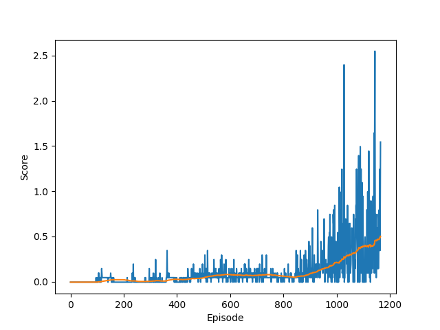

# Introduction:
This report is for the third and last project of Deep reinforcement learning nano-degree on Udacity.
This project is about training 2 agents to play tennis together
In this  report we will present :

1. Algorithm : the algorithm used to train the 2 agents (DDPG)
2. Hyper parameters 
3. the results 
4. Future improvements

# I- Algorithm 

In this project we use DDPG algorithm which stands for **D**eep **D**eterministic **P**olicy **G**radient

Our agents will see one state of length 24 that represents to the position and velocity of the ball and the racket...

the main goal of the agents is to keep the tennis ball off the ground. If an agent hits the ball over the net, it gets +0.1 as a reward else it receives -0.01

The agent is basically composed of two main neural networks (4 total):
 
 1. Actor neural network (Local and target) : the Policy Network
    - Input layer 24 nodes (the size of the state)
    - Hidden layer of shape (256,128) nodes
    - output layer : size of an action which is equal to 2

 2. Critic neural network (Local and target) : the value Network
    
    - Input layer 24 nodes (the size of the state)
    - Hidden layer of shape (256,128)
    - output layer : 1

# II- Hyper parameters 

    BUFFER_SIZE = 10.000  # replay buffer size
    BATCH_SIZE = 128  # minibatch size
    GAMMA = 0.99  # discount factor
    TAU = 0.001  # for soft update of target parameters
    LR_ACTOR = 0.0001  # learning rate of the actor
    LR_CRITIC = 0.0001 # learning rate of the critic
    WEIGHT_DECAY = 0  # L2 weight decay

# III- Results :
My agent solved the environment in 178 episodes 

    Episode 100     Average Score: -0.00400 Score: 0.04500
    Episode 200     Average Score: 0.02090  Score: -0.00500
    Episode 300     Average Score: 0.00500  Score: -0.00500
    Episode 400     Average Score: 0.02650  Score: 0.04500
    Episode 500     Average Score: 0.04280  Score: 0.09500
    Episode 600     Average Score: 0.07825  Score: 0.09500
    Episode 700     Average Score: 0.06950  Score: 0.09500
    Episode 800     Average Score: 0.06200  Score: 0.04500
    Episode 900     Average Score: 0.08600  Score: 0.04500
    Episode 1000    Average Score: 0.21500  Score: 0.19500
    Episode 1100    Average Score: 0.39150  Score: 0.94500
    Enviroment solved in episode=1166 avg_score=0.50200

Below you will find the plot of the score in each episode 

 

# IV- Future improvements :

Hyper parameter tuning can be beneficial to the learning of the agents (manipulating the learning rate, the weight decay, the size of the hidden layers ...)

Another technique that we can try is D4PG which stands for **D**istributed **D**istributional **D**eterministic **P**olicy **G**radients.